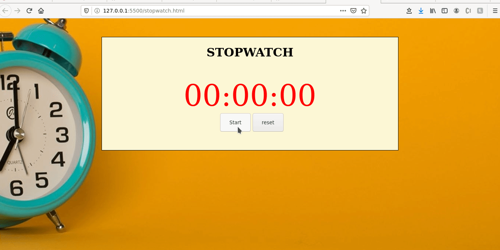

## `StopWatch`

Handheld timepiece designed to measure the amount of time that elapses between its activation and deactivation.

### `ScreenShots`
Demo 

 
  

### `Installation and Setup Instructions`

Clone down this repository and open stopwatch.html to run  on your machine.

## `Tools Used`

`HTML`

`CSS`

`JavaScript`

### `Deployement` 

deployement tool used: https://www.github.io/
